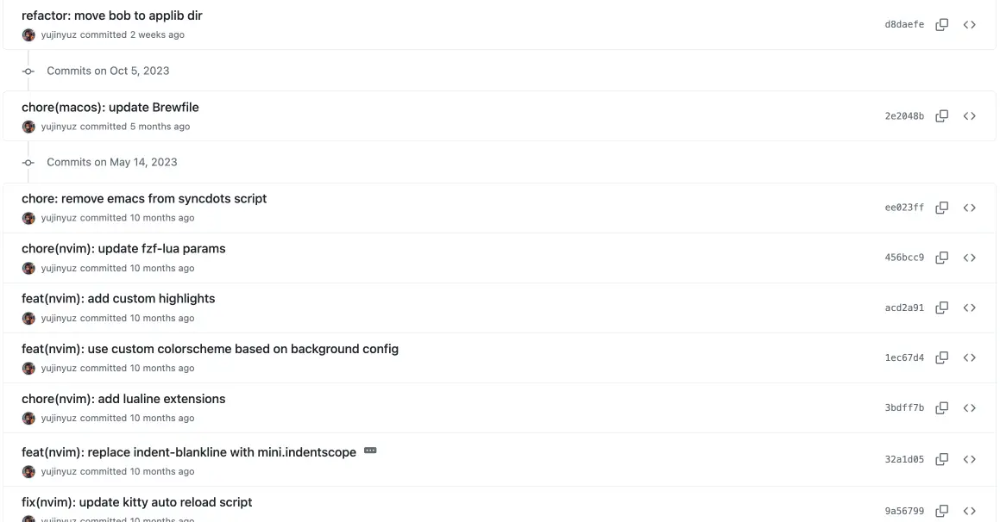

It's been a while since I last posted in my webspace. A lot has happened over the past 2-3 years, I
guess.

Especially during covid where I felt like I lost 2 years of my life being locked inside the house I
was renting in.

I even remember we had to obtain permits just to go outside and we were only allowed on specific
schedules (Monday, Wednesday, Saturday), and had to use face mask and face shield.

Anyway, it didn't affect me that much since I do think it was favorable on my part since everybody
had to work remotely. I was even able to shave off some weight during covid times so I guess I'm
thankful about it?

## Shutdown

I'm not really sure what happened but when everything was slowly going back to normal, I did not
notice but I've been slowly drifting away from my routine and habits.

During covid, I was able to build a routine where I'd go intermittent fasting for 16 hours, do daily
journals, and even meditation.

I don't remember exactly what happened, but I think there had been ways where I was putting off the
habits I built one by one. From doing daily journals to none, meditating from 15-30 minutes a day
down to none, and skipping intermittent fasting.

Maybe covid allowed me to do those since I was only limited to being alone at home and had nothing
else to do.

Ever since then, things went down hill for me.

Look at the results that happened. I'm having a hard time focusing on my work and even my personal
life. I became lazy and gained weight, and I don't even know how to move forward with my life.

Back then, I had really high hopes for my self that I can reach further.

## Reboot

I've been a die hard fan of the Vim Philosophy and been using Neovim for around 5 years.

I haven't touched my configuration for a long time.

I did perform some changes to my [dotfiles](https://github.com/yujinyuz/dotfiles) but I barely had
any time to come up with a message and commit the the files to git.

It started around 2-3 weeks ago~, where one of the core plugins that I've been using just sent a
deprecation notice.

That pulled the trigger for me to do something with my config since it's gonna affect my workflow.
Luckily, I was able to finish migrating to [nvim-lint](https://github.com/mfussenegger/nvim-lint) +
[conform.nvim](https://github.com/stevearc/conform.nvim).

Little did I know that working on my dotfiles had been
[therapeutic](https://twitter.com/nixcraft/status/1770053566616760459/photo/1) for me, in some way
or another.

I could even related to this [reddit post](https://www.reddit.com/r/neovim/comments/1biuuwa/the_calm_between_configurations/).

> The calm between configurations

If you're reading this and a fan of having a keyboard centric workflow, you probably should watch (or read)
[Sharpening the Axe by Greg Hurrell](https://wincent.com/blog/sharpening-the-axe)



where he talks about how he would spend countless hours configuring his environment to do the job.

Anyway, modifying my config somehow propelled me into another path, and here I am right now, writing
this blog post about rebooting.

I've been actively updating my config for the past 2 weeks and I feel like I've reignited something
within myself. I'm thankful for the null-ls/none-ls plugin that they deprecated one of their
features and forced me to look for alternatives.

## Uptime

The best way to understand ones self is to write, and that's what I'm doing. I am planning to do
this in the long term and I'm not expecting anything. I just want to dump my thoughts every week and
come up with some clever titles like this post.

The next actions I think I should do is to fix my sleeping schedule, create a routine, get physical.

I already have some plans where I would go cycling every Tuesday and Thursday. I thought about doing
it everyday but I decided not to since it might result into not going cycling anymore and will lead
to inconsistency. I'll slowly build things up, and once I get the momentum, I'll probably do it on a
daily basis.

I would also need to include meditation into my routine. I do think that it helped me become more
aware of myself and everything around me. I'll start by doing 30-seconds to 1 minute of meditation
and ramp it up when I build my habits.

It's quite hard working remotely, well at least for me, since I have poor time management. I
probably have to work on that but right now I don't even have a working schedule.
I mean I want to, but I just have a lot of distractions within the apartment I'm renting.

We do daily stand up meetings during 10AM and for the past months (or I guess a year), I'm waking up
around _9:00 to 9:30 ish_. And every after stand up, I go cook our brunch and then eat. And after
eating, I'd take a rest and resume at a later time of the day again. Usually around _14:00 or 15:00_.
**That's** really something that I need to work on.

I forgot to mention. One of my goals during my career as a Software Engineer is to become one of the
resource speaker and I'll probably talk about neovim or anything related to tools. We already got
plenty of devs talking about the next best thing and rarely see talks about tools.

Oh well, that's probably enough of my ranting.

I just finished updating the hugo version of my site and it's now up and running.

To more weekly journals! 🥳
