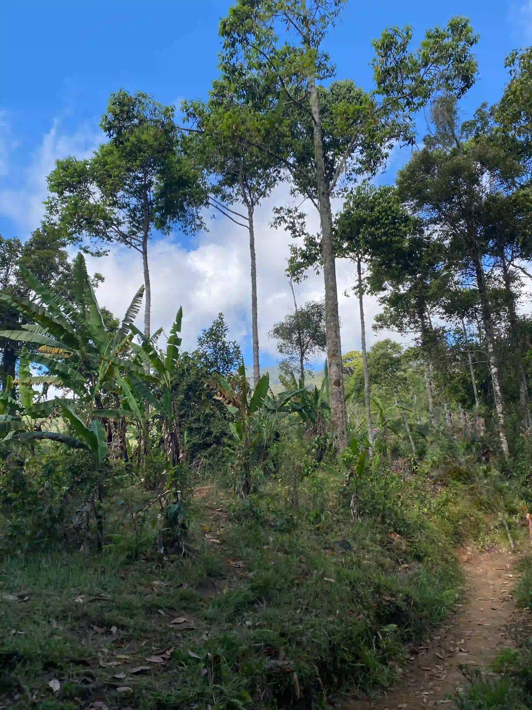
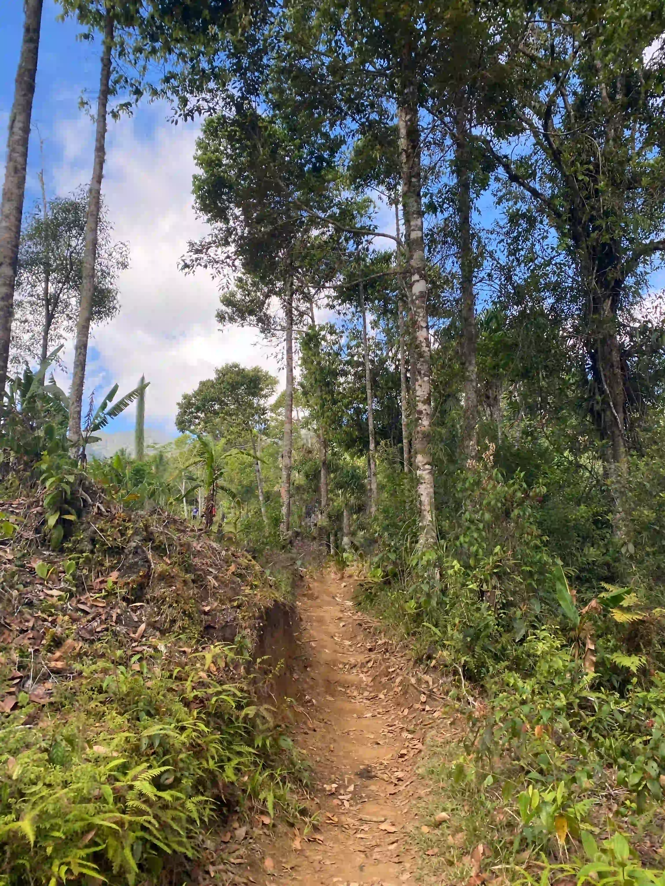
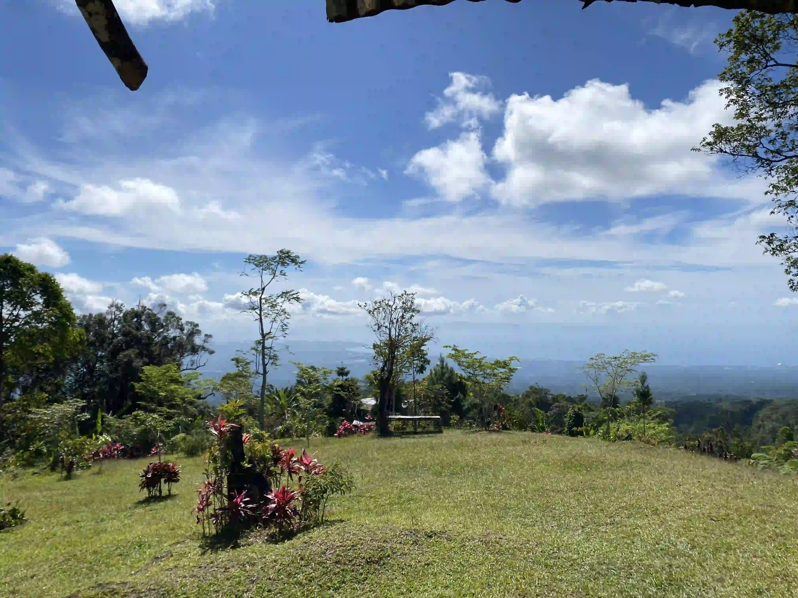
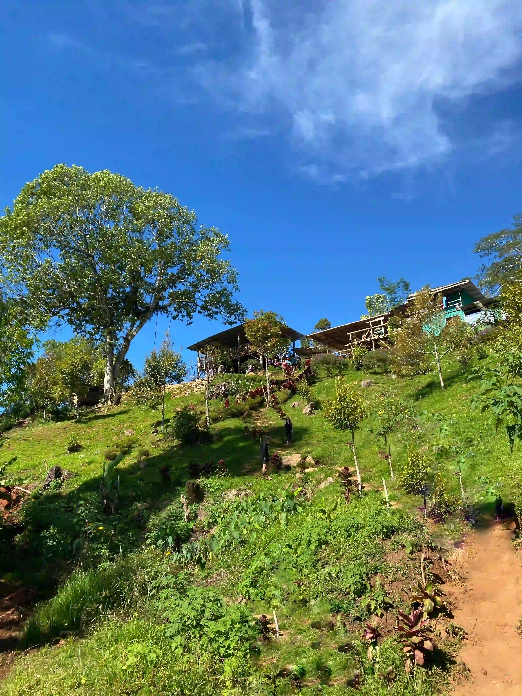

## Rule of three

> When you don't know what you want to do, write.

Just one of the things I saw on social media this week that makes me realize why I'm doing this.
It's to provide me direction into the life I've always wanted. And for that to happen, I need to
write down my thoughts in order to understand myself better.

Also, I didn't realize that I'm kind of applying the _Rule of three_ for creating titles for my post
every week. And this week's Journey index number also matches it so I guess this is kind of a
special post? Let's see how this goes as I've already mentioned before about having to choose topics
on what to write.

I'm still having difficulties in sleeping early and it makes me feel like my lifespan is just
decreasing.

Traversing to the roots of my family tree, it seems that we have an average life span of around 80
years old. But that doesn't seem to be the case for our generation!

## Tax

One of the infuriating things about the Philippines is not having to pay tax, but the process of filing
it.

I've gone through the process of registering myself as a Freelancer _last year, 2023_. It has been
successful, but I had to go through hell in order to accomplish it.

I'm currently on macOS and the only way to file taxes _"online"_ is by using their app called
[eBIR Forms](https://www.bir.gov.ph/index.php/eservices/ebirforms.html).

It's a _Windows_ only application and it doesn't look like they are planning to convert it into a
web app in the future[^1].

The interface is antiquated in a sense that I remember the good old _Visual Basic 6_ during my
sophomore days.

I hope registering and filing taxes becomes so easy that people would rather register themselves as
freelance professionals rather than avoiding it because they would have to go through an arduous
process.

## Hiking

I got an invite _last Saturday night_ to go on a hike on _Sunday_ early morning. I was quite
hesitant at first to accept it since I've been having problems sleeping and the I might wake up late
or at least, I wouldn't have less than 7 hours of sleep. But I accepted anyways since this might be
the antidote to my insomnia as I haven't had sunlight for months now.

On to the day of hiking, it was a _7.4 kilometers_ round trip hike with _491 m_ elevation gain. We finished
around _4 hours_ according to Strava tracking app.

It was one of the great weekends I had so far this year since it includes nature, and not me sitting
in the front of my computer or probably still sleeping.

The view was great and I could say that it was a form of detoxification, at least for me, as I was
disconnected to technology and had time to reconnect to friends and old acquaintances.

It was one of those experiences where it didn't feel good while doing it but felt great after as I
have not _walked/hiked_ that long in awhile.

Here are some of the shots I took while hiking[^2]:

Going up was hard, but going down was quite harder. Especially since it took a toll on my knees.
Probably it was because I'm quite heavy for my size since I don't exercise that often.

I said it was easy going up since I didn't have to think about what would happen since I'm just
pulling my body upward, but doing down, every step I take -- I had to hold back since I'm thinking I
might fall and I guess that took my knees out of service for the day.

It still hurts, whenever I bend my knees or straighten it. I'm guessing it's gonna be a while to
recover but I do hope I'd recover within 3 days or at least just let me use my legs to perform basic
things.

I'm thinking that it was probably because of the shoes I'm using that made my legs hurt. I'll try
buying a new one for running and see if that's the case.

Would I go back again and hike? Hell, yeah! I'd probably start training like walking every morning
or evening -- or maybe even start short sprints just to keep my body in shape.

> Take care of your mind, your body will thank you. Take care of your body, your mind will thank you
>
> -- <cite>Debbie Hampton</cite>

[^1]: I was thinking about converting the app into something more usable especially for people like
    me who are in macOS. The final output of the app is just an `.xml` file with information some
    provided. But I'm not sure how it's sending that file to _BIR_. I'll probably look into that.
[^2]: I converted the images to `.webp` format since that compresses the image and lets me save up
      some bandwidth when committing files to GitHub as I'm only currently using netlify to host my
      website. Original size was around 8MB~ and this site is just meant for me to have something
      memorable when I get old.
