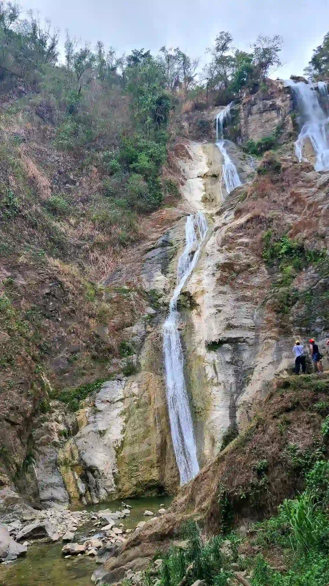

## Autobots

AI has been a thing for quite a while since the release of OpenAI. Almost every product nowadays
uses it in someway, and if you are not, then you're probably gonna get left behind.

I was recently assigned a task which I think is quite complicated (at least for me) of implementing
a design where we generate a workflow compatible with the current product we're building to make on
boarding new users seamlessly.

It's amazing how 2 (or more) AIs could talk to each other. One AI generates the workflow based on a
given specification, and the other reviews it. They'd go back and forth until they come into a final
output.

I guess I could use this to improve my overall skills in writing by having a critic AI. But to what
extent do I have to rely on it? I mean what if I come to a point where I'll just let AI take over
what I did -- in a sense where I'd just accept its criticisms and not understand how and why it gave
it.

But for me to also improve is to have feedback, which I don't have at the moment, and to widen my
vocabulary by reading more.

I guess we'll find out!

## Window Manager

I got bored at some point during the week. And since I like micro-optimizing, I'm constantly looking
for ways on improving my workflow.

I remembered the time that I installed Manjaro [^1] (or probably something within the Arch Linux
distribution) where it had a window manager. I encountered people using it especially within the
Linux community where most of the power users have a window manager installed like i3, bspwm, and
more.

I really didn't know how to use nor utilize a window manager before. I just know that I wanted to
become a power user so I just used it but never really had a chance to explore and understand why I
they use it.

I suddenly remembered it and thought I'd try a window manager for macOS which is
[yabai](https://github.com/koekeishiya/yabai).

I found an awesome guide on how to use it, so I procrastinated again and went on configuring yabai
and [skhd](https://github.com/koekeishiya/skhd)



So far it kinda fits really well with my workflow since I can use my keyboard when switching between
windows, and even opening applications. I could even send a running application to another Desktop
which I couldn't do before because I had to use a mouse.

One thing I'd miss with my old setup is that I use Raycast to convert window sizes into 1/4 of the
screen which I use when recording. It's not a deal breaker though. Now, I just have to rely on my
window manager to calculate it's position on screen.

I guess I'm not really 100% benefiting on using window managers since I think it would be ideal for
larger screens and dual displays. But that's okay. I'll probably get used to this once I get enough
experience.

## Falls

We went on a hike again, but this time it's a new place that has waterfalls. I'm still having
problems walking downhill since my knees keep on shaking. The route was quite new to me since we
went downhill first and then uphill.

It actually felt more like a beginner's rock climbing instead of hiking since the path wasn't that
obvious, and I had to hold on to ropes, branches, and rocks as we climbed.

I wasn't able to take pictures because it was too damn scary to take out your phone, we're
already tired from hiking and the heat of the sun, and there's a risk that you might fall if you're
not careful.

Overall, I think the hike was worth it since there was a flowing river at the top where you can
swim.

I don't know how to swim, and don't really like the water since it makes me feel kinda dizzy and I
don't like getting water in my ear. It just kills the mood since my focus goes into removing the
water from my ear instead of enjoying the overall experience.

Given a chance of going back, I'd probably do it -- but not in the near future since I had mixed
feelings of fear, fatigue, and enjoyment.

[^1]: My main computer broke that time which is the Macbook Pro 2017. And had to use another laptop
    which isn't macOS so it was either that or WSL.
