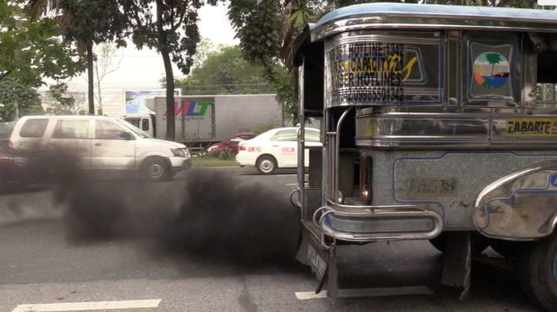

I couldn't think of a good title and I don't even know whether I should continue creating one but I
guess it's quite fun and gives me a little bit of a summary of what I did that week[^1].

## Wheels

Before I ended my week, I was able to migrate one of my projects from heroku to render.
It only needed a few line changes and I was up and running. But that's not the reason why I brought
that up.

I just wanted a reminder for myself to create a new post about starting Django projects, create a
*.whl file and deploy that instead of the typical `gunicorn myproject.wsgi`

Though this needs a different structure, it seems pretty cool once you understand it and makes
things a bit easy since you only need to have generated *.whl file and do a `pip install
project.whl` and you're done!

## Streaming

I've already made some setup for my streaming using OBS and was just trying to stream privately on
Facebook.

I decided to publicly stream on Facebook and I was surprised that there were some of my facebook
friends that watched it. It even reached around 100~ views, not viewers though, just views but it
was still impressive.

I realized that I needed to have some kind of pop-up on my screen or something where I could read
comments. What I just do currently is to use another phone and read the comments with it. But
there's some kind of static noise happening while doing that so I have to close it immediately and
just focus on work.

I was lucky enough that the code base I was working on was an open-source one and I was just
finishing things up by writing test cases.

I wasn't even speaking because I was laser focused on what I was doing and I didn't even know how to
interact properly with those the people viewing the stream.

I'll eventually get there. This was more of a test run on how it feels streaming.

## Holidays

Ever since I started working remotely, I could barely notice any upcoming holidays unless someone I
know mentions it.

It's a bit odd living in the Philippines in terms of holidays. I noticed that in other countries,
the most common ones are around _-ber_ months, Christmas, and New Year. While we almost have a
holiday here in the Philippines every month!

It's not that I _hate_ holidays, but I'm working in an environment with a **_No Work, No Pay_** set
up. So I'd rather be working on holidays than to go out.

Though I do need time offs from time to time, but I'd rather do it at a time where it isn't a
holiday in the Philippines so there would be less people around.

And that brings me in to another thing in which I don't like travelling because the transportation
system here is the _worst_ where you have to get in line for hours just to get a seat in the bus.

What I love about the holidays, especially when you live in the city is that people go home to their
respective provinces, and that leaves the roads clear, less people, less traffic. And that's one of
the times I enjoy riding a bike because I don't have to deal with drivers not respecting the bike
lanes and also the smoke emitted by PUVs.[^2]

I should set a specific date and time on when I would start writing up my thoughts for the weekly
journal so I don't end up rushing things. Probably the best day would be a Sunday and the best time
would be around 19:00 after dinner.

[^1]: I kinda forgot to include that I attended an online talk on celebrating Women's month this
    March. It was a great experience to just listen to women in tech and how they got themselves in
    this field!
[^2]: I hope they would do something about this where the smoke emitted is already dangerous, what
    more of the fact that the color of the smoke is black!
